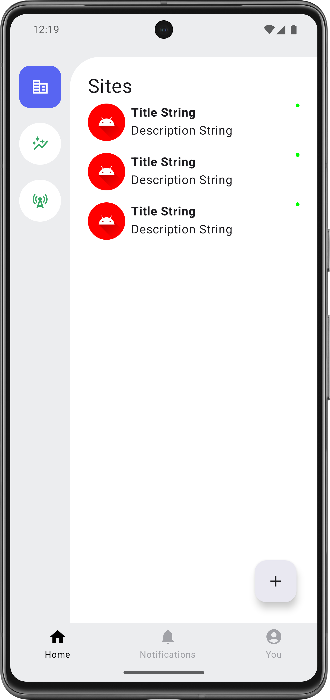
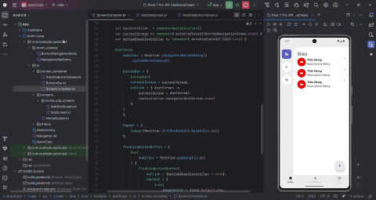

# QuickCast 📡

**QuickCast** is a real-time update Android application that enables devices to communicate and sync via **SMS**, without relying on any backend servers. It's designed for small and medium businesses operating across multiple locations, offering a simple, cost-effective coordination tool.

---

## 🛠 Features

- 🔄 **Real-time updates** using SMS-based JSON transmission
- 🧭 **Hybrid navigation**: Bottom navigation + side rail navigation
- 🧩 **Site (group) management** for business locations
- 🎬 **Custom bottom sheet** with smooth full-screen animations
- 📊 Planned insights and data visualization via charts & graphs

---

## 🧰 Tech Stack

- **Language**: Kotlin
- **UI Toolkit**: Jetpack Compose
- **Architecture**: MVVM
- **Dependency Injection**: Koin

---

## 📱 UI Preview

---

### 🎥 Walkthrough

---

## 🚀 Vision

QuickCast is being built to offer offline-friendly, decentralized coordination without backend dependency. As the app evolves, it will help businesses sync operations and analyze insights—all through the power of SMS.

---

*Work in progress. Stay tuned for updates.*
